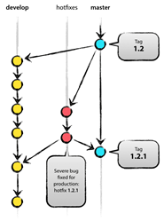

# Lab5 Team Activity - Git workflow

팀원 권우석, 박지윤, 우태희, 오승기, 빈현우, 정재준

---

## 개요

Vincent Driessen이 2010년 1월 5일 개발 모델에 대하여 적은 글은 수많은 개발자들이 자신의 프로젝트를 진행하는 데 영향을 끼쳤고, 아직까지도 가장 많이 이용되는 workflow중 하나이다.

2020년 5월 Vincent Driessen는 자신의 개발 모델에 대한 성찰에서 "모든 프로젝트에 적용되는 만병통치약은 없으니 자신의 프로젝트 맥락에 맞춰 사용해야 한다."라는 말을 남겼다.

이처럼 10년이 지난 오늘날에도 사랑받고 있는 workflow이기에 원문을 번역하며 개발 모델을 학습해보기로 했다. 원문은 Git의 장점과 함께 자신의 개발 모델을 branch를 중심으로 설명한다. branch는 Main branch(master, develop)와 Supporting branch(Feature, Release, Hotfix)로 나뉘어 총 5개이고 각 branch의 목적과 사용 방법을 설명하는 방식으로 글이 전개된다.

---

이 게시물에서는 작년 몇몇 프로젝트(일과 개인적인 프로젝트 모두)에서 소개한 성공적인 개발 모델을 보여주려 한다. 나는 한동안 이 개발 모델에 대해 글을 쓰고 싶었지만 지금까지 시간이 허락하지 않았다. 나는 프로젝트의 세부 사항은 생략하고, 단지 branching 전략과 형상 release 관리에 대해서만 설명할 것이다.

## Why Git?

중앙 집중형 관리 시스템 와 비교했을 때 Git이 가지는 장단점에 대한 치열한 논쟁은 웹을 통해 확인할 수 있다. 그곳에는 불꽃 튀는 전쟁이 계속해서 일어나고 있다. 개발자로서, 나는 오늘날 어떤 도구보다 Git을 선호한다. Git은 merging과 branching에 대해 개발자가 생각하는 방식을  
완전히 바꾸었다. 내가 이전에 사용했던 고전적인 CVS/Subversion에서, merging과 branching은 항상 위험한 것으로 여겨졌고(merge 충돌이 일어나면, 팀원들은 당신을 물어뜯을 것이다!) 모든 것을 한 번에 진행해야 했었다.

> CVS - Concurrent Versions System의 약자로 1980년대 만들어진 형상관리 프로그램이다. 파일 관리나 커밋 중 오류 시 롤백이 되지 않는 등 기술적인 문제가 많아 요즘은 사용되지 않는다.

> Subversion - 문제가 있던 CVS를 대체하기 위해 탄생한 형상관리 도구이다. tag와 branchs라는 개념을 지원하여 형상(버전) 관리를 편하게 만들었다.

하지만 Git에서는, 이러한 작업들이 굉장히 쉽게 이루어지고 일별 workflow에서 핵심적인 요소 중 하나이다. 예를 들어, CVS/Subversion 교본에서는 branching과 merging은 전문가를 위한 마지막 챕터에서 다루는 주제이지만 Git 교본에서는 3번째 챕터에서 다루는 기본적인 주제이다.

Git의 단순함과 반복적인 특성의 결과로 branching과 merging은 더 이상 두려움의 대상이 아니다. 형상 관리 도구들은 그 무엇보다 branching과 merging을 도울 수 있어야 한다.

도구에 대한 이야기는 충분하니 개발 모델에 대해 이야기해보자. 앞으로 소개할 모델은 기본적으로 모든 팀원이 소프트웨어 개발 과정을 관리하기 위해 따라야 하는 절차에 지나지 않는다.

---

## Decentralized and centralized

우리가 사용하는 저장소 설정은 소개할 분기 모델과 잘 작동하며 중앙에 "진실" 저장소를 가지고 있다. 이 저장소는 오직 중앙 저장소로만 여겨진다는 점을 유의해라.(Git은 DVCS이기 때문에 기술적 수준에서 중앙 저장소는 없다.) 우리는 이 저장소 이름이 모든 깃 사용자에게 익숙해질 때까지 origin이라 부를 것이다.

> DVSC - Distributed Version Control Systems의 약자로 Git은 대표적인 분산 버전 관리 시스템이다.

각 개발자들은 origns에서 pulls와 push를 수행한다. 하지만 중앙 집중화된 push-pull 관계 이외에, 각 개발자들은 다른 동료들의 변경사항을 pull 하여 하위 팀을 형상할 수도 있다. 예를 들어, 이 방법은 작업 과정을 origin(중앙 저장소)에 pushing 하기 전에, 둘 이상의 개발자가 함께 커다란 새로운 기능을 개발하기에 유용할 것이다. 위의 그림에서는, Alice와 Bob, Alice와 David 그리고 Clair와 David가 하위 팀을 이룬다.

엄밀히 말해, 이것은 Alice가 Bob의 저장소를 가리키며 git 저장소를 bob 이란 이름으로 정의한 것을 의미한다.

=======

## The main branches

#  </img>

> master

> develop

핵심적으로, 개발 모델은 기존에 있던 모델에서 영감을 받았다. 중앙 저장소는 제거되지 않는 두 개의 main branch(master와 develop)를 가지고 있다.

origin 저장소에 있는 master 브랜치는 모든 Git 사용자들에게 익숙할 것이다. master 브랜치와 평행하는 또 다른 브랜치는 develop이라 부른다.

우리는 origin/master를 HEAD의 소스코드가 항상 생산 준비 상태로 반영된 main branch로 여긴다.

우리는 origin/develop를 HEAD 소스코드가 항상 다음 배포를 위한 최신 개발 변화를 전달 준비가 된 main branch로 간주한다. 몇몇은 develop 브랜치를 '통합 branch'라 부르기도 한다. 이곳은 모든 automatic nightly builds가 건설되는 곳이다.

develop branch가 안정적인 위치까지 도달하여 배포할 준비가 되었을 때, 모든 변화는 master 브랜치에 병합되어야 하고 배포 번호로 tag 되어야 한다. 어떻게 이 과정이 완성되는지 자세한 설명은 차후에 논의하겠다.

그러므로, 변화가 master 브랜치로 병합되는 매 순간 정의에 의해 새로운 새로운 배포가 생산되는 것이다. 우리는 이 문제에 대해 매우 엄격하기 때문에 이론적으로는 master에 대한 commit이 있을 때마다 소프트웨어를 자동으로 구축하고 생산 서버에 롤아웃하기 위해 Git hook 스크립트를 사용할 수 있다.

---

## Supporting branches

main branch인 master과 develop 다음으로, 우리의 개발 모델은 팀원들 간의 평행적인 개발을 돕고, 변경 사항 추적을 쉽게 하고, 생산 배포를 준비하고 문제점들을 빠르게 수정할 수 있도록 보조하기 위한 다양한 지원 branch를 사용한다. main branch와 달리, supporting branch는 항상 사용 기한이 유한하고 결국에는 제거될 것이다.

각각의 branch들은 구체적인 목적을 가지고 어떤 branch는 기원이 되는 branch 여야 하고 또 다른 branch는 그들의 병합 대상이 되어야 하는 등의 엄격한 규칙이 정해져 있다. 우리는 잠시 후 이점에 대해서 알아볼 것이다.

이 branch들은 기술적으로 특별한 것은 아니다. branch의 종류는 우리가 branch를 어떻게 사용하는지를 기준으로 나뉜다. 그것들은 물론 기본적이고 오래된 Git의 branch 들이다.

---

### Release branches

> Realease branches : develop branch로부터 나와 develop와 master branch로 병합된다.

Release branches는 새로운 production 배포 준비를 지원한다. Realease branch들은 마지막 순간 점을 찍고 i's에서 t's로 넘어갈 수 있도록 돕는다. 더 나아가, 배포를 위해 작은 bug를 고치거나 meta-data를 준비하는데 사용되기도 한다. 이 모든 것을 release branch에서 수행함으로 debelop branch는 다음 세대 배포를 위한 변경 사항을 받을 수 있도록 깔끔하게 유지된다.

develop branch로부터 새로운 release branch가 떼어져 나오는 중요한 순간은 develop branch가 새로운 배포를 위해 필요한 사항을 거의 다 반영한 시점이다. 적어도 배포에 목표한 모든 변경 사항은 deveop branch에 모두 반영된 순간이어야 한다. 미래 배포를 목표로 만들어진 모든 변경 사항이 그러한 건 아닐지라도 그들은 release branch가 떼어져 나갈 때까지 기다려야 한다.

정확히 release branch의 시작점에서 다가오는 배포는 version number를 할당받는다. - 그 이전이 아니다. 개발 version number를 부여받는 순간까지, develop branch는 다음 배포를 위한 변화를 반영한다. 하지만 다음 배포가 0.3일지 1.0일지는 불명확하기 때문에 release branch가 시작될 때까지 변화를 반영한다. 배포에 대한 결정은 release branch가 시작될 때 내려지며 프로젝트의 규칙에 의해 수행된다.

---

### Hotfix branches

> Hotfix branch : master branch로부터 나와 develop나 master 브랜치로 병합된다.

Hotfix branches들은 비록 계획되지는 않았지만 새로운 배포를 준비한다는 점에서 release branch와 매우 흡사하다. Hotfix branch는 배포되어 있는 버전의 불만족스러운 상태를 즉각적으로 보완하기 위해 만들어졌다. 생산 버전에 있는 치명적인 bug를 즉시 해결해야 할 때, hotfix branch는 생산 버전을 표기하는 master branch와 일치하는 tag에서 떨어져 나온다. 중요한 건 hotfix의 보완 작업이 진행되는 동안 팀원들의 개발(develop branch)이 지속될 수 있다는 것이다.

---

### Summary

이 branching 모델에서 충격적인 것은 없지만, 이 게시물의 시작에 있는 "big picture"그림은 우리의 프로젝트에서 매우 유용하다는 것을 알게 되었다. 이것은 이해하기 쉽고 팀원들이 branching과 releasing 과정을 공유할 수 있도록 만드는 우아한 정신이 깃든 모델이다.

---
